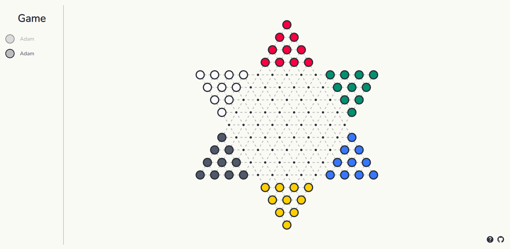
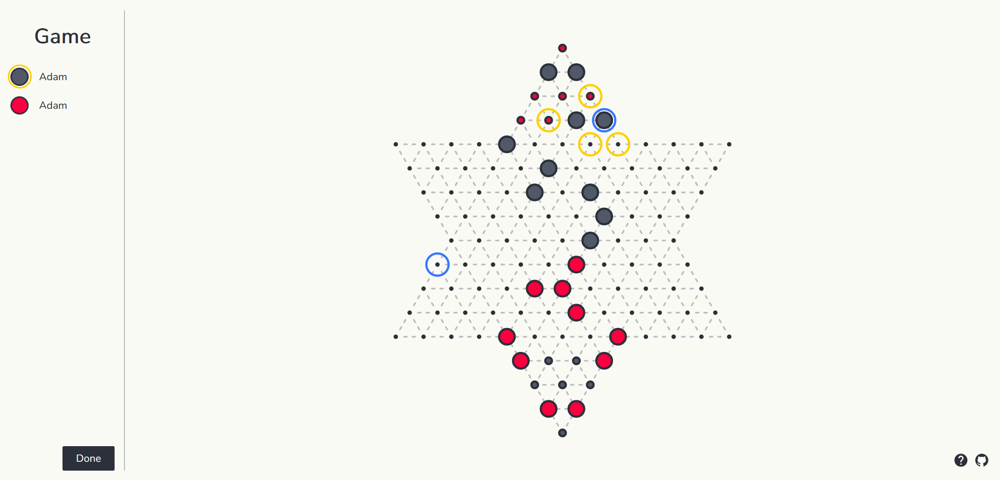
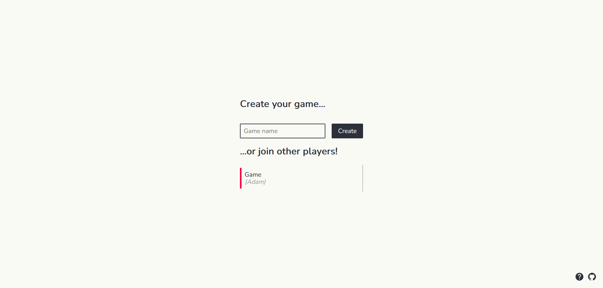

# Trilma

Chinese checkers implemented in Node.js using `express.js` and `socket.io`.

## Running

This project uses [pnpm](https://pnpm.io/). To build and run it type these commands:

```sh
  $ pnpm install
  $ pnpm run build
  $ pnpm run start
```

Following environment variables must/may be set in `.env` file or manually:

- `SECRET` (**required**) - secret used to sign cookies.
- `PORT` - port to listen on.

Alternatively, you can generate tarball containing only necessary code without sources:

```sh
  $ pnpm run build && pnpm run pack
  $ tar zxvf trilma-server-0.0.0.tgz && cd package
  $ pnpm install --prod  # Or `npm install --production`
  $ node .
```

## Development

```sh
  $ pnpm run build:dev
  $ pnpm run start:dev
```

## Screenshots




